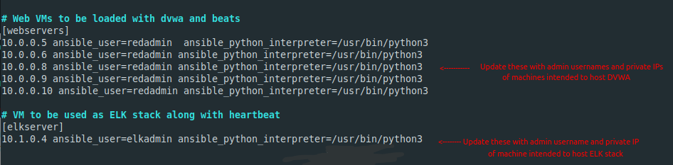

## Automated ELK Stack Deployment

The files in this repository were used to configure the network depicted below.

These files have been tested and used to generate a live ELK deployment on Azure. They can be used to either recreate the entire deployment pictured above. Alternatively, setup.yml can be modified or run with tags to install certain pieces of the infrastructure to your liking.

This document contains the following details:
- Description of the Topology
- Access Policies
- ELK Configuration
- Beats in Use
- Machines Being Monitored
- How to Use the Ansible Build

### Description of the Topology

The main purpose of this network is to expose a load-balanced and monitored instance of DVWA, the Damn Vulnerable Web Application.

Load balancing ensures that the application will be highly available, in addition to restricting access to the network.

Integrating an ELK server allows users to easily monitor the vulnerable VMs for changes to the essential system files, suspicious web activity, up-time, system metrics, and system logs.

The configuration details of each machine may be found below.

| Name         | Function                                   | Private IP Address | Operating System         |
|--------------|--------------------------------------------|--------------------|--------------------------|
| Jump-Box     | Ansible provisioner and admin access point | 10.0.0.4           | Linux (Ubuntu 18.04 LTS) |
| Web-1        | DVWA server                                | 10.0.0.5           | Linux (Ubuntu 18.04 LTS) |
| Web-2        | DVWA server                                | 10.0.0.6           | Linux (Ubuntu 18.04 LTS) |
| web-backup   | DVWA server                                | 10.0.0.8           | Linux (Ubuntu 18.04 LTS) |
| DVWA-Backup1 | DVWA server                                | 10.0.0.9           | Linux (Ubuntu 18.04 LTS) |
| DVWA-Backup2 | DVWA server                                | 10.0.0.10          | Linux (Ubuntu 18.04 LTS) |
| ELK-Server   | Hosts ELK docker container and heartbeat   | 10.1.0.4           | Linux (Ubuntu 18.04 LTS) |

### Access Policies

The machines on the internal rednet network are not exposed to the public Internet. 

Only the Jump-Box machine can accept connections from the Internet. Access to this machine is only allowed from the public workstation IP detailed in RedTeam-SG.

Machines within the rednet network can only be accessed by ssh.

A summary of the access policies in place can be found in the table below.

A load balancer is utilized to allow http access to the DVWA only from your supplied public IP.

| Name              | Publicly Accessible | Allowed IP Addresses            |
|-------------------|---------------------|---------------------------------|
| Jump-Box          | Yes                 | workstation public IP port 22   |
| Web VMs           | No                  | 10.0.0.4 port 22                |
| Red_Load_Balancer | Yes                 | workstation public IP port 80   |
| ELK-Server        | Yes                 | workstation public IP port 5601 |

### Elk Configuration

Ansible was used to automate configuration of the ELK machine and multiple DVWA machines. This allows the use of infrastructure as code. Allowing the user to scale their network as large as they want. This also grants the user the ability to modify only a few files and change the configuration of every machine on the network.

The playbook implements the following tasks:
- Set up the ELK-Server with an ELK stack docker container
- Install each web VM with a docker container with an instance of DVWA
- Install Heartbeat on the ELK-VM for up-time metrics
- Install Filebeat, Auditbeat, Packetbeat, and Metricbeat on each web VM
- Configures each machine to send logs to the ELK-Server
- Updates each machine to current packages to ensure system security

### Target Machines & Beats
This ELK server is configured to monitor the following machines:
 
- Web-1 10.0.0.5
- Web-2 10.0.0.6
- web-backup 10.0.0.8
- DVWA-Backup1 10.0.0.9
- DVWA-Backup2 10.0.0.10

We have installed the following Beats on these machines:
- Filebeat
- Metricbeat
- Auditbeat
- Packetbeat

**Note**: The ELK-Server has heartbeat installed for up-time metrics as it is advised to install this on a machine not intended to be monitored.

These Beats allow us to collect the following information from each machine:
- Filebeat: Collects and forwards system log data to Elk-Server
- Metricbeat: Monitors system metrics like CPU usage, memory, and network acticvity. We have enabled the docker module to watch our DVWA containers as well
- Auditbeat: Interacts directly with and forwards logs from auditd, a system daemon that watches for system changes. It will log file integrity for files found in `/etc` `/usr/bin` `/bin` `/usr/sbin` and `/sbin`
- Packetbeat: Analyzes network traffic between systems, sniffing packets providing user with network information
- Heartbeat: Monitors up-time of systems. Will ping each machine on the network on a regular schedule and logs repsonses

### Using the Playbooks
In order to use the playbooks, you will need to have an Ansible control node already configured on your Jump-box. Assuming you have such a control node provisioned: 

SSH into the control node and follow the steps below:
- Copy the repository(You can omit the Images directory and the readme) to `/etc/ansible`
- Update the hosts file to include the private IPs of your intended elk server and web VMs under [elkserver] and [webservers] and their set admin usernames

- Update the configuration file found in each `/etc/ansible/roles/files` directory for each beat to include the IP address of your elkserver under Kibana and Outputs categories. Below is an example:

- Run the [setup.yml](setup.yml) playbook, and navigate to http://<elkserver_ip>:5601 and http://<load_balancerip> to check that the installation worked as expected. Kibana and DVWA should load respectively.

**Note** : If heartbeat is intended to be installed modify the [heartbeat-config.yml](roles/heartbeat/files/heartbeat-config.yml) further as such:

### Customizing the playbook

You can specify what parts of the playbook to run using the supplied tags:

- elk : Sets up just the ELK server
- heartbeat : Installs heartbeat on ELK server 
- dvwa: Sets up just the DVWA docker container on the web VMs
- beats: Installs filebeat, auditbeat, packetbeat, and metricbeat on web VMs

**Example tag usage** : 
- `ansible-playbook setup.yml -t=elk,dvwa` will install the ELK stack and the DVWA containers on the web VMs and will not install any beats.
- `ansible-playbook setup.yml --skip-tags=elk,heartbeat` will skip installing the ELK stack and heartbeat but will install DVWA containers and the other beats services.

**Note** : 
If you wish to just install any combination of beats and not the above five all at once you can use the [custom.yml](custom.yml) playbook. 

- First run the [setup.yml](setup.yml) playbook using tags elk and dvwa as such : `ansible-playbook setup.yml -t=elk,dvwa`
- Then run `ansible-playbook custom.yml -t=<any_combination_of_beats_you_want>` (the flag `-t=filebeat,heartbeat` will install just filebeat and heartbeat as an example)

### Automating cloud network updates

If you wish to update all your machines at once through apt for the most up to date packages on your cloud network you can also use the Ansible provisioner to do so!

- Run the [update_machines.yml](update_machines.yml) playbook
- You can supply either tag of webvms or elk to just update the respective machines

If you want to update config files for the beats services and the changes to take effect on all VMs across your cloud network you can run [update_config.yml](update_config.yml).

- Update the desired config file in `/etc/ansible/roles/<desired_beat>/files/`
- Run the update-config.yml playbook with a supplied tag for beat service to be updated. You can update one, multiple, or all machines this way. Ansible will reload the config file and restart the service.

### Example full setup

Run these following commands to perform a full setup of ELK stack server monitoring DVWA virtual machines from workstation to deployment. (This is assuming you have an Ansible docker container on your jump-box set up)

- `ssh redadmin@<jumpbox_public_ip>`
- `sudo docker container list -a` (Locate the ansible container on jump-box)
- `sudo docker start <container_name>`
- `sudo docker attach <container_name>`
- `cd /etc/ansible`
-  **Edit all required files to unique infrastructure of your cloud network (hosts, and each beats config file)**
- `ansible-playbook setup.yml` 

**Note** : Below are screenshots of successful installation:

The following screenshot displays the result of running `docker ps` on the Elk-Server after successfully configuring the ELK instance.

The following screenshot displays the result of running `service --status-all | grep beat` on the web VMs 

The following screenshot shows the result of running `docker ps` on the web VMs

